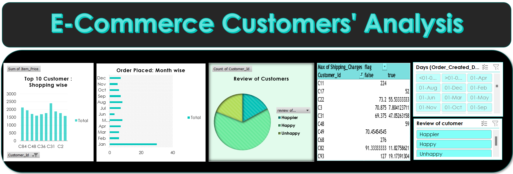

# E-commerce Customer Analysis Using Excel

## Project Overview

This project involves a detailed analysis of customer behavior and sales data for an e-commerce platform. The analysis was performed using Microsoft Excel, leveraging advanced features such as pivot tables, charts, and data analysis tools to extract actionable insights.

## Key Objectives

1. Customer Segmentation: Identify and categorize customers based on their purchasing behavior.
2. Sales Analysis: Analyze sales trends over time to identify peak sales periods.
3. Customer Lifetime Value (CLV): Calculate the lifetime value of customers to understand long-term profitability.
4. Product Performance: Evaluate the performance of different products and categories.
5. Churn Analysis: Identify customers at risk of churn and suggest retention strategies.

## Data Source

The dataset used for this project includes customer demographics, transaction history, and product details. It comprises several thousand rows of data collected over a period of one year.

## Analysis Techniques

- Pivot Tables: Used to summarize and analyze large datasets, providing insights into customer behavior and sales trends.
- Data Visualization: Created various charts and graphs to visually represent data, making it easier to identify patterns and trends.
- Statistical Functions: Employed Excel’s statistical functions to calculate key metrics like CLV, average order value, and churn rate.

## Results and Insights

- Top Customers: Identified the top 5% of customers contributing to 40% of the total revenue.
- Seasonal Trends: Discovered that sales peak during the holiday season, with a significant increase in average order value.
- High-Value Products: Found that a small number of products contribute to the majority of sales, suggesting a focus on these items for future promotions.

## Conclusion

This project provides a comprehensive analysis of customer behavior and sales performance for an e-commerce platform. The insights gained can be used to drive business decisions, improve customer retention, and optimize marketing strategies.

## How to Use

1. Open the Excel file in Microsoft Excel.
2. Navigate through the different sheets to explore the analysis.
3. Use the slicers and filters provided in the dashboard to customize the view according to your needs.

## Contact Information

For any questions or further information, please contact:

- Name: Jyoti Sharma
- Email: jyotisharma112698@gmail.com
